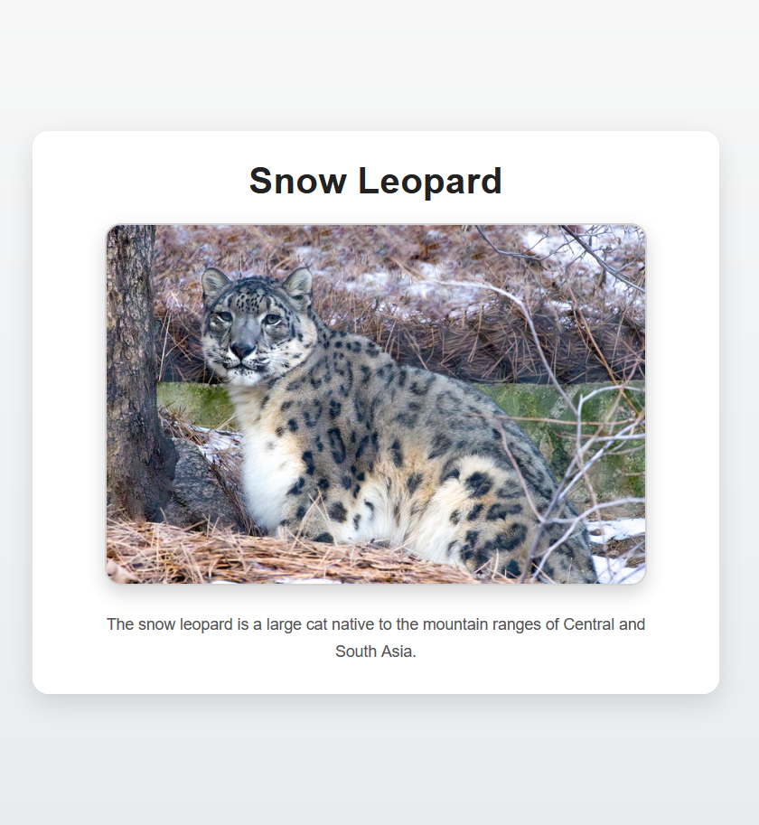

# Snow Leopard Image Page

## Preview

## Description
A simple webpage built with HTML and CSS that displays an image of a snow leopard with styled text and layout. The project focuses on basic styling, layout organization, and visual improvements using external CSS.

## Features
- Title displayed above the image
- Centered layout using a container
- Responsive image with max width
- Rounded image corners
- Hover/focus effect on the image
- Styled text (font, size, and color)

## Technologies
- HTML5
- CSS3 (layout, spacing, hover effects)

## Concepts Applied
- Linking external CSS files
- Image styling and responsiveness
- Centering elements with CSS
- Using `border-radius` for rounded corners
- Adding hover and focus effects
- Improving layout with containers and spacing

## How to Run
1. Download or clone the repository
2. Open the `index.html` file in your browser

## Author
Gabriel Carretts