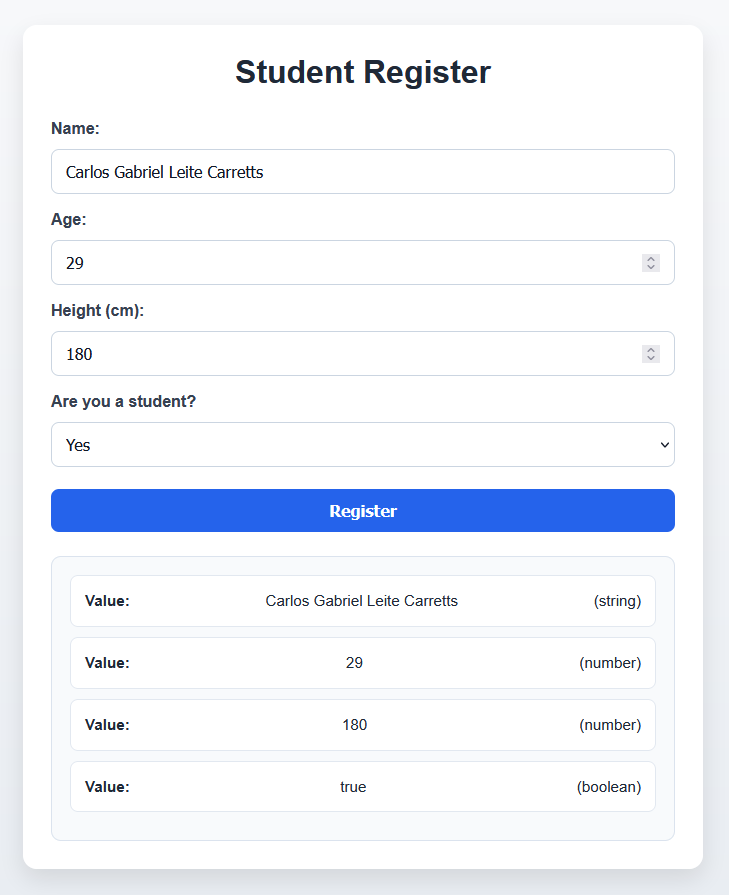

# Student Register (JavaScript Variables)

A simple web application built with HTML, CSS, and JavaScript that demonstrates the use of fundamental data types and dynamic DOM manipulation.

This project was created as part of a learning assignment focused on understanding JavaScript variables, data types, and user interaction.

---

## Preview


---

## Features

* Collects user input through a form:

  * Name (string)
  * Age (number)
  * Height (float)
  * Student status (boolean)
* Converts input values into appropriate JavaScript data types
* Displays:

  * Value of each variable
  * Type of each variable using `typeof`
* Outputs results:

  * In the browser using dynamic HTML
  * In the console using `console.log()`
* Clean and responsive UI with modern CSS styling

---

## Technologies Used

* HTML5 – Structure and form inputs
* CSS3 – Layout, styling, and responsiveness
* JavaScript (Vanilla) – Logic, DOM manipulation, and event handling

---

## Project Structure

```
activity-2/
│── activity-2.html
│── activity-2-style.css
│── activity-2.js
```

---

## Concepts Practiced

* JavaScript variables (string, number, boolean)
* Type conversion:

  * `parseInt()`
  * `parseFloat()`
* Boolean logic using comparisons (`===`)
* `typeof` operator
* DOM selection (`getElementById`)
* Event handling (`addEventListener`)
* Preventing default form behavior (`event.preventDefault()`)
* Dynamic content rendering with `innerHTML`
* Template strings (`` `...${}` ``)

---

## How to Run

1. Download or clone the repository
2. Open `activity-2.html` in your browser
3. Fill out the form
4. Click **Register**
5. View:

   * Results displayed on the page
   * Output in the browser console (F12)

---

## Purpose

This project focuses on reinforcing core JavaScript concepts by combining:

* User input
* Data processing
* Output visualization

---

## Author

Carlos Gabriel

---

## Notes

* This project is part of a learning portfolio
* Emphasis is placed on JavaScript fundamentals rather than complex UI design
