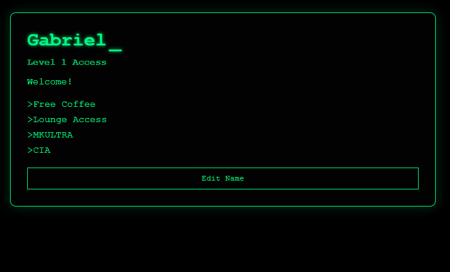

# Editable Profile (DOM Manipulation)

A small web application built with HTML, CSS, and JavaScript that demonstrates basic DOM manipulation through user interaction.

This project was developed as part of a learning assignment focused on updating page content dynamically using JavaScript and dialog boxes.

---

## Preview



---

## Features

* Displays a simple “profile” interface:

  * User name
  * Access level
  * Welcome message
  * List of perks
* Allows the user to:

  * Click a button to edit the displayed name
  * Enter a new name using a dialog box (`prompt`)
* Updates the page dynamically without reloading
* Terminal-style UI (black and green theme)

---

## Technologies Used

* HTML5 – Page structure and elements
* CSS3 – Terminal-style UI and layout
* JavaScript (Vanilla) – DOM manipulation and event handling

---

## Project Structure

```
activity-3/
│── activity-3.html
│── activity-3-style.css
│── activity-3.js
```

---

## Concepts Practiced

* DOM selection (`getElementById`)
* Event handling (`addEventListener`)
* User input with `prompt()`
* Updating content using `textContent`
* Conditional logic (`if`)
* Separation of concerns (HTML, CSS, JS)

---

## How It Works

1. The page loads with a default user:

   * "Guest User"
2. The user clicks the **Edit Name** button
3. A dialog box appears asking for a new name
4. If a value is provided:

   * The name is updated dynamically in the `<h1>` element
5. No page reload occurs

---

## How to Run

1. Download or clone the repository
2. Open `activity-3.html` in your browser
3. Click the **Edit Name** button
4. Enter a new name in the prompt

---

## Purpose

This project reinforces core JavaScript concepts by combining:

* User interaction
* DOM manipulation
* Dynamic content updates

It also introduces basic UI styling to make the project more visually engaging.

---

## Author

Carlos Gabriel

---

## Notes

* This is a front-end only project (no backend or database)
* The prompt-based input is intentionally simple to match assignment requirements
* Focus is on understanding DOM manipulation rather than complex UI systems
