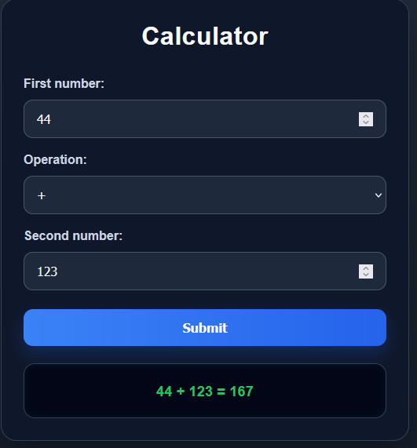

# Calculator Page

A simple calculator web application built with HTML, CSS, and JavaScript.

This project allows the user to choose an arithmetic operation, enter two numbers, and receive the result directly on the page. It was created as part of a learning assignment focused on user input, arithmetic logic, and dynamic DOM updates.

---

## Preview

---

## Features

* Two number inputs
* Operation selector
* Supports:

  * Addition
  * Subtraction
  * Multiplication
  * Division
* Dynamic result display on the page
* Division by zero validation
* Calculator-style dark interface

---

## Technologies Used

* HTML5
* CSS3
* JavaScript (Vanilla)

---

## Concepts Practiced

* Form handling with JavaScript
* DOM selection using `getElementById`
* Event handling with `addEventListener`
* Preventing default form submission with `event.preventDefault()`
* Number conversion using `parseFloat()`
* Conditional logic with `if / else if`
* Dynamic content updates with `textContent`
* UI feedback with conditional CSS classes

---

## How It Works

1. The user enters the first number
2. The user selects an operation
3. The user enters the second number
4. When the form is submitted:

   * JavaScript reads the values
   * performs the selected operation
   * displays the result on the page
5. If the user attempts to divide by zero, an error message is shown in red

---

## How to Run

1. Download or clone the repository
2. Open `activity-4.html` in your browser
3. Enter two numbers
4. Choose an operation
5. Click **Submit**

## Purpose

This project was created to practice:

* user input handling
* arithmetic operations
* conditional logic
* dynamic result display with JavaScript

---

## Author

Carlos Gabriel
