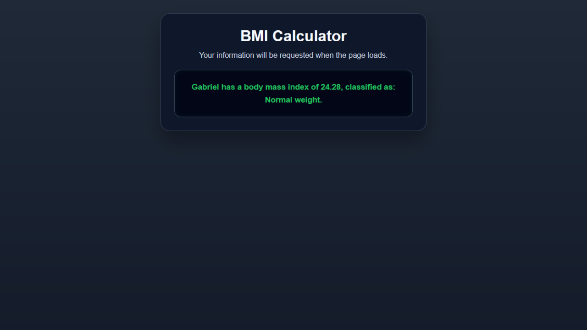

# BMI Calculator

A simple BMI (Body Mass Index) calculator built with HTML, CSS, and JavaScript.

This project collects a person's name, height, and weight using `prompt()` dialogs, calculates the BMI, classifies the result, and displays the final message on the page.

---

## Screenshot



```

---

## Features

* Requests:

  * Name
  * Height in centimeters
  * Weight in kilograms
* Converts height and weight to numeric values
* Converts height from centimeters to meters
* Calculates BMI using the standard formula
* Classifies BMI according to health ranges
* Displays the final result on the page
* Shows the result in an alert box as well

---

## Technologies Used

* HTML5
* CSS3
* JavaScript (Vanilla)

---

## Concepts Practiced

* User input with `prompt()`
* Number conversion with `parseFloat()`
* Arithmetic operations
* Conditional logic with `if / else if`
* BMI calculation formula
* Dynamic DOM updates with `textContent`
* Output formatting with `toFixed(2)`

---

## How It Works

1. The page loads

2. The script asks for:

   * the person's name
   * height in centimeters
   * weight in kilograms

3. The script converts the numeric inputs

4. Height is converted from centimeters to meters

5. BMI is calculated using:

   `BMI = weight / (height in meters × height in meters)`

6. The BMI is classified into one of the defined ranges

7. The final message is shown on the page and in an alert

---

## BMI Classification

* Below 16: Very severe underweight
* 16 to 16.99: Severe underweight
* 17 to 18.49: Underweight
* 18.5 to 24.99: Normal weight
* 25 to 29.99: Overweight
* 30 to 34.99: Obesity class I
* 35 to 39.99: Obesity class II
* 40 or more: Obesity class III

---

## How to Run

1. Download or clone the repository
2. Open `activity-5.html` in your browser
3. Enter the requested information in the prompt boxes
4. View the final BMI result on the page

---

## Purpose

This project was created to practice:

* user input
* numeric conversion
* formulas in JavaScript
* conditional classification logic
* displaying calculated results dynamically

---

## Author

Carlos Gabriel
